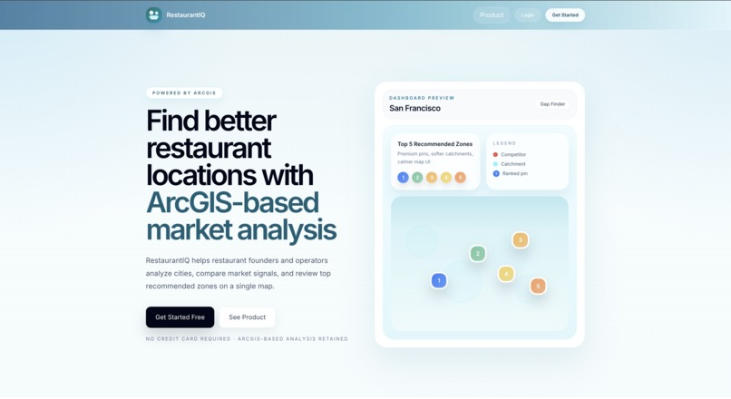
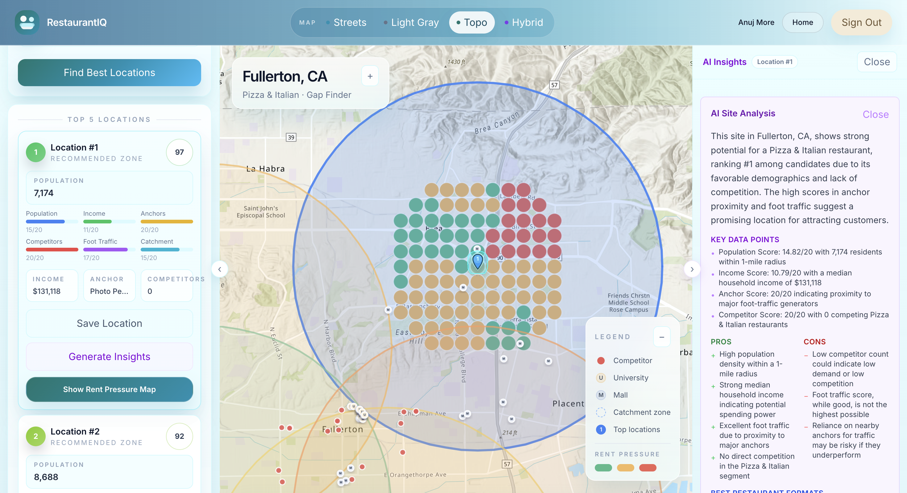

# RestaurantIQ — Client

React frontend for RestaurantIQ, an ArcGIS-powered location intelligence tool for restaurant site selection.

**Repos:** [Server](https://github.com/OfficialAnujMore/Restaurant-IQ-Server)

## Demo

[](https://youtu.be/VoYTlok4mdE?si=1gPWw3Siexrv3Wkb)






## Problem Statement

Finding the right location for your new restaurant is expensive and risky. RestaurantIQ lets operators pick a city, cuisine, and competitive strategy, then scores a grid of candidate locations across demographics, foot traffic, anchor proximity, and competitor density — ranking the top 5 spots and visualizing them on an interactive map.

## Tech Stack

| Technology | Version | Purpose |
|---|---|---|
| **React** | 19 | UI framework |
| **Vite** | 8 | Build tool and dev server |
| **Tailwind CSS** | 4 | Utility-first styling |
| **@arcgis/core** | 5 | Interactive map, geocoding, basemap rendering |
| **React Router** | 7 | Client-side routing (Landing, Login, Register, Map) |
| **Axios** | 1.x | HTTP client for backend API calls |

## Pages & Components

- **LandingPage** — marketing/entry page
- **LoginPage / RegisterPage** — JWT-based auth forms
- **MapView** — main ArcGIS map canvas with pin rendering
- **Sidebar** — city/cuisine/strategy input form
- **ScoreCard / ScoreBar** — ranked location results
- **InsightsSidebar / InsightPanel** — AI-generated analysis per location
- **SavedPanel** — saved candidate locations (persisted via MongoDB)
- **LayerToggle** — toggle map data layers
- **Navbar / ProtectedRoute** — navigation and auth guards

## Setup

```bash
npm install
```

Create `.env`:

```
VITE_ARCGIS_API_KEY=your_arcgis_api_key_here
VITE_API_URL=http://localhost:5000
```

```bash
npm run dev
```

The Vite dev server proxies `/api/*` → `http://localhost:5000`.

> **macOS note:** port 5000 conflicts with AirPlay Receiver. Disable it in System Settings → General → AirDrop & Handoff, or update the proxy target in `vite.config.js`.

## Scripts

| Command | Description |
|---|---|
| `npm run dev` | Start Vite dev server with HMR |
| `npm run build` | Production build to `dist/` |
| `npm run preview` | Preview production build locally |
| `npm run lint` | Run ESLint |
